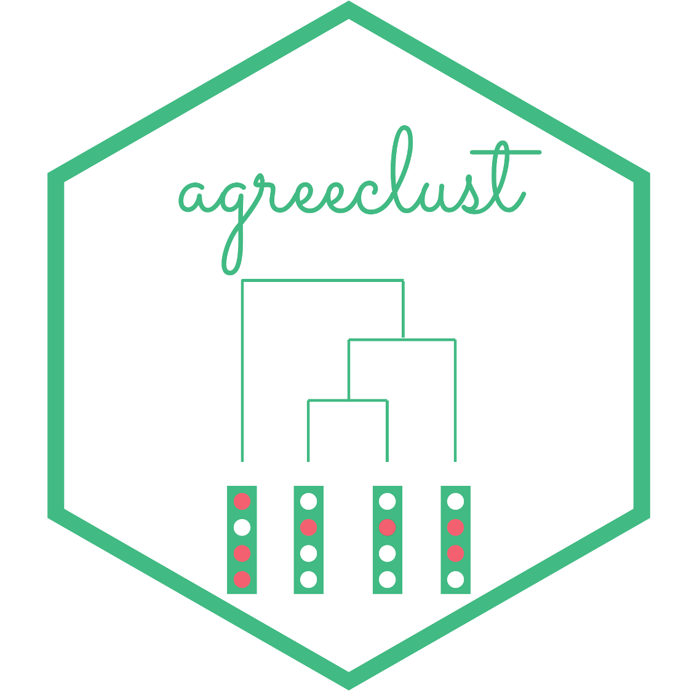

<!-- README.md is generated from README.Rmd. Please edit that file -->

```{r, include = FALSE}
knitr::opts_chunk$set(
  collapse = TRUE,
  comment = "#>",
  fig.path = "man/figures/README-",
  out.width = "100%"
)
pkgload::load_all()
```

# agreeclust 

The `{agreeclust}` package considers a latent class regression modeling framework for highlighting the structure of disagreement among panels of raters involved in an inquiry. On the contrary to popular approaches, the present method considers the ratings data provided by all raters when studying the structure of disagreement among the panel. More precisely, the structure of disagreement is captured through the profiles of residuals of a no-latent class regression model adjusted on the entire set of binary ratings, and can be visualized by using exploratory data analysis tools. The disagreement between two raters is then quantify in a concise way through the Euclidean distance between their respective profiles of residuals, this disagreement index being used as a basis to construct a dendrogram representing the structure of disagreement among the panel. The proper number of disagreed clusters among the panel of raters is then chosen by implementing a sequential strategy to test the significance of each $K$-clusters structure of disagreement.

To get the current version from GitHub:

```{r eval = FALSE}
if(!requireNamespace("devtools")){install.packages("devtools")}
devtools::install_github("MargotBr/agreeclust", build_vignettes = TRUE)
library(agreeclust)
```

# Repex

```{r eval = TRUE, message = FALSE, warning = FALSE, dpi = 400}
library(agreeclust)
data(binary_data_for_example)
res_pedag <- get_agreeclust_bin(dta = binary_data_for_example,
                                id_info_rater = 9 : nrow(binary_data_for_example),
                                type_info_rater = c(rep("cat", 2), "cont"),
                                id_info_stim = 21 : ncol(binary_data_for_example),
                                type_info_stim = c(rep("cont", 4), "cat"),
                                paral_null = FALSE,
                                graph = FALSE)
names(res_pedag)
plot_agreeclust(res_pedag)
# plot_agreeclust(res_pedag, interact = TRUE)
```
